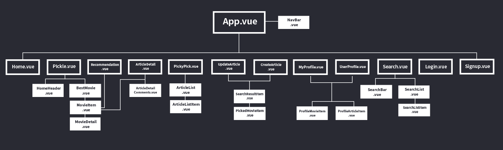
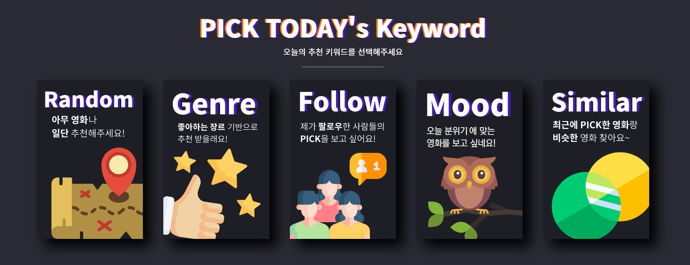
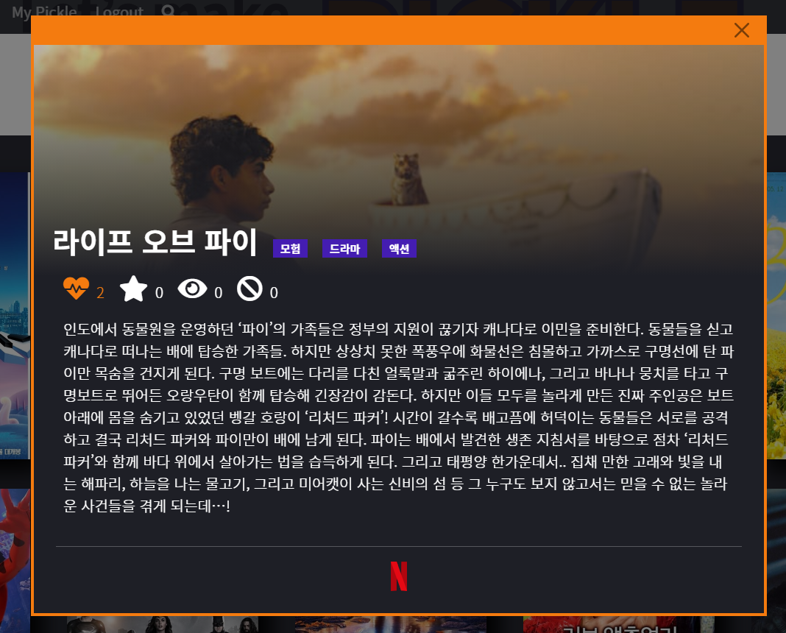
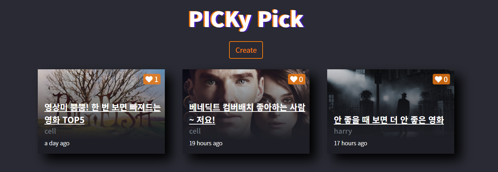
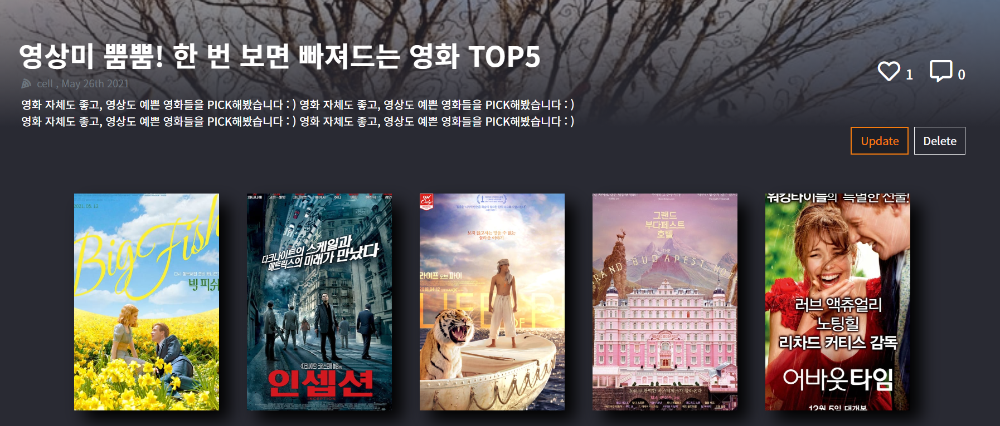
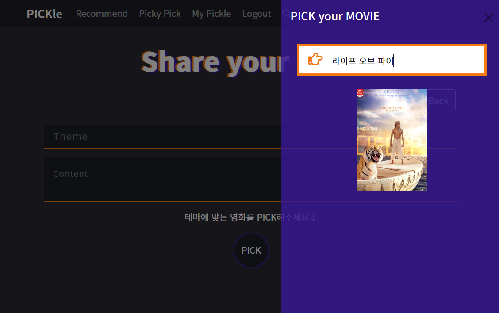
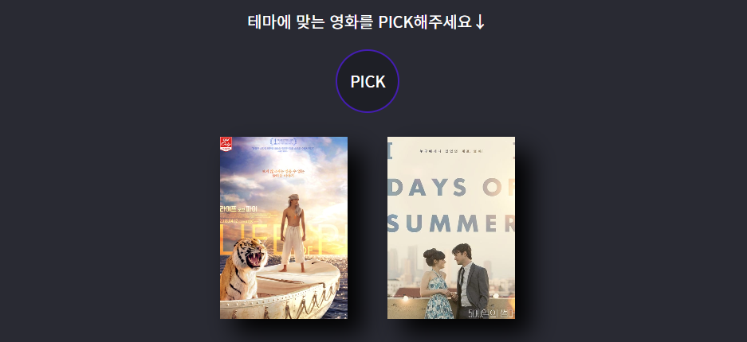
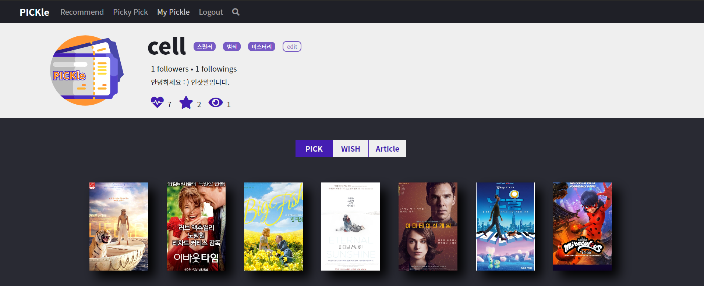

# PICKle🍕

> Vue와 Django를 활용한 영화 추천 웹 서비스 개발 공간입니다.

## 🌈 About

- 개발 언어
  - Vue.js 2.X | Node 14.16.1
  - Python 3.8.7 | Django 3.2.3
  
  
  
- 팀원 정보 및 업무 분담

  - 이세라 | Client & Server
  - 조원영 | Server
  
  

## 🌟 Overview

- Key Concept
  - **PICK**
    - **PICK simpLE** 👉 간편하게 PICK하고
    - **PICK valuabLE** 👉 소중한 것을 PICK하고
    - **PICK with articLE** 👉 다른 사람의 PICK이 담긴 글과 함께 PICK 하기

- ERD

  

- 컴포넌트 구조

  

## 🚀 Service

#### 1. 사용자 PICK에 집중한 추천 시스템

- PICKLE은 사용자의 선호 장르, 영화에 대한 평가(좋아요/보고싶어요/이미봤어요/관심없어요), Follow한 사람 등을 기준으로 다양한 추천 기능을 제공합니다.

  

  - 각각의 카드를 선택하면 그에 맞는 추천 영화를 제공하고, 사용자가 이미 본 영화나 관심 없음을 표시한 영화는 제외합니다.
    1. Random 추천
    2. 사용자가 선호하는 Genre의 영화 추천
    3. 사용자가 follow한 사람의 PICK 추천
    4.  오늘 날씨에 따른 영화 추천
    5. 사용자가 최근에 PICK한 영화를 기반으로 줄거리가 유사한 영화 추천

#### 2. 영화 평가 시스템

- 영화에 대한 사용자의 반응을 4가지로 구분했습니다.

  - 좋아하는 영화 / 보고 싶은 영화 / 이미 본 영화 / 관심 없는 영화

- 영화 포스터에 마우스 오버를 하거나 영화 디테일 페이지에서 평가를 남길 수 있습니다.

  

  

#### 3. 직접 큐레이션한 영화 리스트 공유

- 사용자들이 자신의 PICK을 공유할 수 있는 커뮤니티 기능입니다.

  

  

  - 게시글에 대한 좋아요 / 댓글 쓰기가 가능하고,

  - 게시글 작성/수정/삭제와 댓글 삭제를 할 수 있습니다.

    

    - 영화 큐레이션을 위한 검색이 가능하고 선택된 영화는 아래에 나타납니다.

      

#### 4. 사용자 프로필 정보

- 사용자 프로필 정보에서는 해당 사용자가 좋아하는 영화 / 보고 싶은 영화 / 작성한 게시글을 확인할 수 있습니다.

  

## 👀 Project Review

#### 👾 아쉬운 점 + 에러 + 버그 기록하기

- 작업을 하면서 401 / 404 / 500 에러가 자주 발생했는데,
  - 401의 경우, token 연결 확인,
  - 404의 경우, api request 확인,
  - 500의 경우, 오타나 index out of range 확인으로 해결했습니다.
- 초반에 front에서 pipe broken 관련 에러가 발생했는데,
  - 서버의 응답을 기다리지 않고 클라이언트에서 처리가 되는 문제를 해결하기 위해 `async-await`를 많이 활용하게 되었습니다.
- vue-multiselect 라는 외부 라이브러리를 활용했는데,
  - 스타일 커스텀이 쉽지 않아 결국 포기하게 되었습니다.
- vue의 일부 로직에서 사용자의 활동을 반영하지 못하는 문제가 있는데,
  - 예를 들면 for 문 안에 있는 article 데이터를 업데이트 해주기 위해 전체 데이터를 받으면 모달 컴포넌트가 사라지는 경우들이었고 JS를 통해 필요한 부분만 계산하도록 작업을 했지만 약간의 시간차가 생기고 있습니다. 전체적인 흐름을 고쳐야 하는 것 같아 이후에 다시 한 번 보려고 생각 중입니다.
- 사용자가 해당 페이지를 떠날 때, state에 있는 데이터를 초기화하고 싶었는데 destroyed로 가능한가 싶었지만 불가능했습니다..🙃
- 검색 결과에서 input 이벤트로 요청을 보내다보니 검색을 완료했을 때, 이전에 보낸 응답이 늦게 도착해 결과가 제대로 나오지 않는 경우가 있었습니다. 정확하지는 않지만, 아무래도 글자수가 적을수록 해당하는 영화 데이터가 많기 때문에 발생하는 문제인 것 같아 2글자 이상 input이 들어왔을 때 요청을 보내는 방식으로 수정해 문제를 조금 해결하기는 했지만 조금 더 요청과 응답에 대해 알아봐야 할 듯합니다.
- 초반에 iframe을 통해 트레일러 영상을 보여주려 했으나, 로딩 속도가 너무 느려 백드롭 이미지로 대체했습니다.