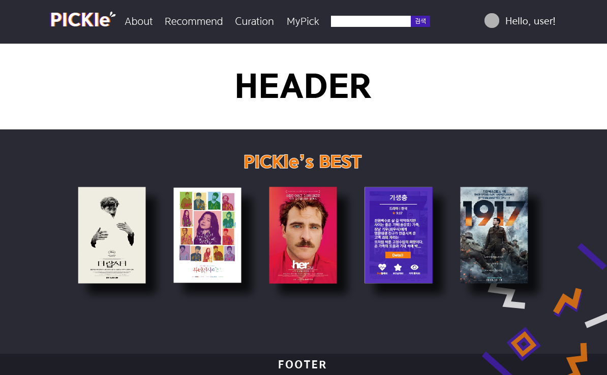

# PICKle🍕

> Vue와 Django를 활용한 영화 추천 웹 서비스 개발 공간입니다.

## 🌈 About

- 개발 언어
  - Vue.js 2.X | Node 14.16.1
  - Python 3.8.7 | Django 3.2.3
  
  
  
- 팀원 정보 및 업무 분담

  - 이세라 | Frontend
  - 조원영 | Backend

- 서비스 구현 정도
  - 

## 🌟 Overview

- Key Concept
  - **PICK**
    - **PICK simpLE** 👉 간편하게 PICK하고
    - **PICK valuabLE** 👉 소중한 것을 PICK하고
    - **PICK articLE** 👉 다른 사람의 PICK이 담긴 글도 볼 수 있다!!

- Key Color(임시)

  

- 웹 디자인 가안 

  

- ERD 데이터베이스 모델링

## 🚀 Service

## 👀 Project Review

- 세라

  - **[DAY1] 쉽지 않을 거라고 예상은 했지만, Vue는 정말 복잡하다. 그치만 나는 할 수 있짛ㅎㅎㅎㅎㅎ**

    - login을 구현하면서 router를 통해 Home으로 이동하도록 설정했는데, 새로고침과 함께 login 페이지로 돌아와서 당황했다. 그것은 바로 form 태그를 썼기 때문이었는데, 이걸 찾으려고 3시간을 헤멨다. HTML 태그 중에 기본적인 event 동작을 가진 태그를 쓸 때 주의해야 한다는 사실을 깨달은 오늘의 삽질 추가 🔨🙃🤣 

    - Navbar의 경우, 아직 스타일링이 덜 된 것 같은데 일단 기본적인 기능 구현부터 한 뒤에 스타일링을 하기로 결심했다.

    - method와 axios 요청이 많아질 것 같아 파일을 조금씩 나누기 시작했다.

    - 영화 데이터를 불러오는 작업을 했는데, 필요한 정보를 한 번에 받으려고 하니 for 문이 너무 많아져서 살짝 걱정이 됐지만 ~ 생각만큼 그렇게 오래 걸리지는 않았다. 일단 개발 중 테스트 용으로 100개 데이터만 JSON으로 저장하고, 이후에 추가로 데이터를 받아올 예정..
    
      

